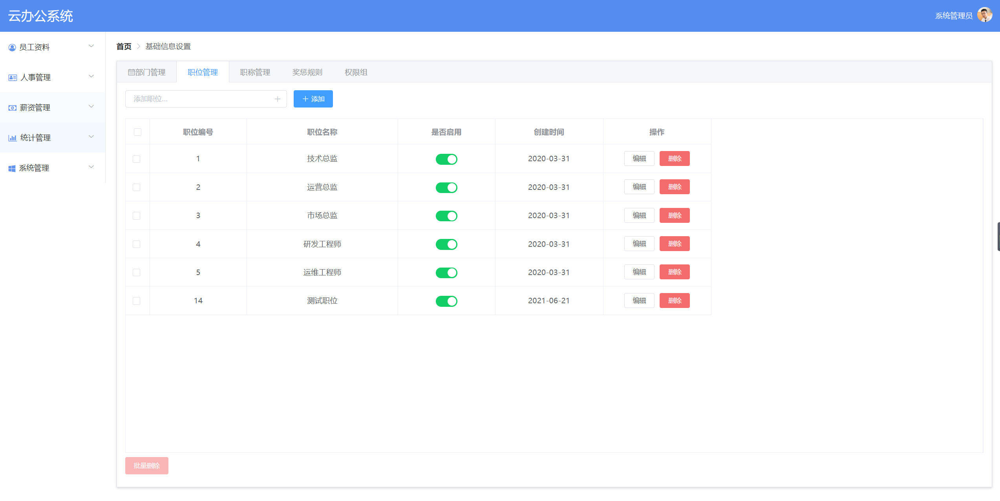
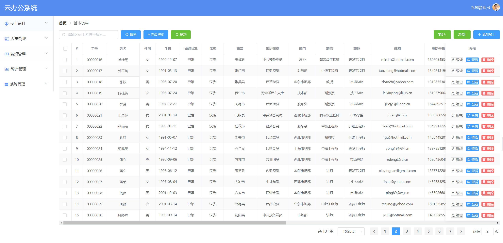

云办管理平台

## 1. 项目简介
### 1.1 项目简介

​		本项目使用了 SpringBoot 等技术构建了一个云办公管理平台。
​        使用Vue + Element UI 做前端页面。


### 1.2 项目使用技术&插件&软件

+ Java 1.8版本（涉及一些Stream处理）+ Idea开发工具
+ Maven Jar包管理
+ Spring Security + SpringBoot + Mybatis Plus 数据库访问和控制器、逆向工程
+ Redis 用做缓存（管理列表菜单缓存、登陆验证码）
+ MySQL 8 数据存储
+ Lombok 插件 （Java 实体类的 Setter和 Getter等）
+ Hutool 工具包（非空判断，登陆验证码生成等）
+ easy-poi 工具
+ Vue + Element UI + WebPack

## 2. yeb-generator 模块

本模块用于初始化数据库，以及构建项目基本结构。

		1. 首先执行`resources/sql/yeb.sql` 中 的建表语句并初始化数据。
  		2. 然后根据 resources/doc/代码生成.md 文档操作，使用Mybatis-Plus的逆向工程，使用数据库生成实体类、Service接口以及Controller、Mapper等部分。

> 若已经生成了这些类或Xml文件，则此模块可不用执行。在生成对应的文件后，将java文件和xml文件粘贴到 yeb-server模块的对应位置即可。

## 3. yeb-server 模块

本模块是核心功能模块，实现了以下功能：

+ 配置并实现了 `SpringSecurity`的权限管理，核心思想是使用了JWT生成token。
+ 使用 Redis 缓存了登陆用户后的菜单列表。
+ 使用Swagger2生成了接口文档。（访问链接为：http://localhost/doc.html）
+ 实现了全局异常处理类，内容有待完善。
+ 实现了Controller同一返回结构类型 `ResponseBean`。
+ 完整的登陆模块实现，验证码使用了`Hutool`中的四则运算验证。
+ 部门管理，在添加和删除时使用了存储过程。
+ 管理员管理，包含管理员查询，修改以及删除功能。
+ 员工管理，包含员工的分页查询（含搜索），添加以及修改、删除功能，导入导出。
+ ...未完待续

### 3.1部门管理中的存储过程
*添加部门*
```sql
CREATE DEFINER=`root`@`localhost` PROCEDURE `addDep`(in depName varchar(32),in
parentId int,in enabled boolean,out result int,out result2 int)
begin
declare did int;
declare pDepPath varchar(64);
insert into t_department set name=depName,parentId=parentId,enabled=enabled;
select row_count() into result;
select last_insert_id() into did;
set result2=did;
select depPath into pDepPath from t_department where id=parentId;
update t_department set depPath=concat(pDepPath,'.',did) where id=did;
update t_department set isParent=true where id=parentId;
end
```

*删除部门*
```sql
CREATE DEFINER=`root`@`localhost` PROCEDURE `deleteDep`(in did int,out result
int)
begin
declare ecount int;
declare pid int;
declare pcount int;
declare a int;
select count(*) into a from t_department where id=did and isParent=false;
if a=0 then set result=-2;
else
select count(*) into ecount from t_employee where departmentId=did;
if ecount>0 then set result=-1;
else
select parentId into pid from t_department where id=did;
delete from t_department where id=did and isParent=false;
select row_count() into result;
select count(*) into pcount from t_department where parentId=pid;
if pcount=0 then update t_department set isParent=false where id=pid;
end if;
end if;
end if;
end
```


## 4. yeb-util 模块

本模块是全局工具类。目前实现了：

+ StringUtil，继承了Hutool中的StrUtil类，并增加自己的方法。
+ Consts，定义常用的字符串常量
+ DecimalFormatUtil，格式化小数，保留到小数点后2位
+ ...未完待续


## 5. yeb-ui模块

本模块是管理系统的页面展示。目前实现了：

+ 登陆页面，验证码使用了redis做为存储校验

### 5.1 webpack 安装
使用以下命令：
```text
# 更换淘宝镜像源，如果没有更换过的话执行这一步
npm config set registry http://registry.npm.taobao.org
# 安装 webpack
npm install webpack webpack-cli -g

调试时 `wepack --watch` 命令，也可以用 `webpack` 直接打包，但是修改文件时不会即时生效。
```

### 5.2 系统管理-基础信息管理-职位管理
+ 添加职位
+ 查询职位
+ 修改启用状态（**注：基本功能已实现，修改条件有待完善**）
+ 编辑职位
+ 删除&批量删除职位（**基本功能已实现，删除条件有待完善**）




### 5.3 系统管理-基础信息管理-职称管理

+ 添加职称
+ 查询职称
+ 修改启用状态（**基本功能已实现，修改条件有待完善**）
+ 编辑职称
+ 删除&批量删除职称（**基本功能已实现，删除条件有待完善**）


### 5.4 系统管理-基础信息管理-权限组

+ 添加角色，给角色赋权限
+ 修改角色权限
+ 删除角色，删除前先将角色对应的权限取消


### 5.5 系统管理-基础信息管理-部门管理

+ 部门树形展示，搜索
+ 添加部门（难点在于不刷新页面的情况下，对树节点进行更新）
+ 删除部门（难点在于不刷新页面的情况下，对树节点进行更新）


### 5.6 系统管理-管理员管理

+ 管理员展示（使用标签页布局）
+ 搜索（包含无数据时的展示）
+ 删除功能
+ 角色分配
+ 用户禁用


### 5.7  员工资料-基本资料

在实现文件下载时，需要安装插件：`npm install js-file-download`

+ 列表展示数据（含分页、按照名字搜索）
+ 添加、修改员工页面绘制、功能实现
+ 导出员工数据、多选员工导出
+ 员工数据导入功能
+ 员工数据高级搜索功能




## 6. 部分截图

### 6.1 Swagger2的测试界面


### 6.2 登陆页


## 7. Rabbit MQ

### 7.1 安装

```shell
# 安装 erlang 依赖
yum -y install esl-erlang_23.0.2-1_centos_7_amd64.rpm

# 安装
yum -y install rabbitmq-server-3.8.5-1.el7.noarch.rpm

# 启动
systemctl start rabbitmq-server.service
# 查看状态：以下为启动状态截图 active running 表示正在运行
systemctl status rabbitmq-server.service
```


```shell
# 安装UI插件，先查看插件列表
rabbitmq-plugins list
# 安装
rabbitmq-plugins enable rabbitmq_management

# 修改配置
cd /etc/rabbitmq
vim rabbitmq.config
[{rabbit, [{loopback_users, []}]}].

# 重启
systemctl restart rabbitmq-server.service
```

登陆：使用默认端口  15672，用户名和密码默认为  guest

http://39.107.102.32:15672/

### 7.2 入门案例

参考：https://www.rabbitmq.com/getstarted.html


